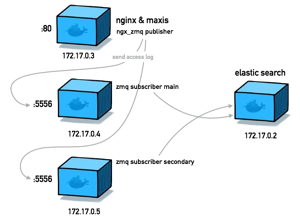

# Personal Goals

Personal goals made open source for accessibility across computers I use, transparency, accountability, and versioning.

## Overarching Goals for 2017:

1. OWASP(The Open Web Application Security Project), RASP(Runtime Application Self-Protection)
2. Develop Gorae
3. Golang
4. 질문하는 사람 (let's become person who have a lots of question)
5. English

## Monthly Plan

* [April](2017/april.md)

### These day

* bot
* chrome extension (for english)

### Mar 27 - Apr 1

* [x] .seed project
  * [x] test mocha/chai
  * [x] cicle ci default configuration
  * [x] report test coverage (coveralls.io)
  * [x] dependency ci (dependencyci.com)
* [ ] React-Boilerplate
  * [ ] Setup Flowtype on [React-Boilerplate](http://github.com/rhiokim/react-boilerplate)
* [ ] Make Chrome extension from scratch
  * [ ] need to find out how to store data using websql in chrome extension without origin sandboxed problem
* [ ] Gorae Registry
  * [ ] Implement webhook list of repository
  * [ ] Implement add new webhook in repository for triggering
  * [ ] Make a screen video - How it works

### Mar 19 - Mar 24

* [ ] React-Boilerplate
  * [x] I'm gonna adapt flowtype checker in [.bare project](https://github.com/rhiokim/.bare) first.
* [x] Make scenario about '나는 요리를 Github(== Open Source)로 배웠다.'

### Mar 6 - Mar 11

* [x] React-Boilerplate
  * [x] Update module dependencies
* [ ] Make Chrome extension from scratch
  * [x] First read this doc - https://developer.ibm.com/clouddataservices/2016/05/11/chrome-extensions-pouchdb/
* [x] Meet 유우영
  * [x] Talking about software communities and seminar about open-source experiences

### Feb 20 - Feb 25

* [x] React-Boilerplate
  * [x] NW.js integrate with latest react-app and some module for offline first app
* [x] Analysis about CDNS/CLB product
* [ ] Read Articles
  * How my friends and I grew our side project into a $17,000/month business - https://medium.freecodecamp.com/growing-a-side-project-into-a-17-000-month-business-46024d2aa87f#.e78qpw6g8
  * A warning from Bill Gates, Elon Musk, and Stephen Hawking - https://medium.freecodecamp.com/bill-gates-and-elon-musk-just-warned-us-about-the-one-thing-politicians-are-too-scared-to-talk-8db9815fd398#.jmkppoxir
* [ ] Gorae Registry
  * [ ] Implement webhook list of repository
  * [ ] Implement add new webhook in repository for triggering

### Jan 23 - Feb 19

* [ ] Thorn Project
  * [x] UI Design: Dashboard
  * [x] UI Design: Status
  * [ ] UI Design: Statistic
  * [x] UI Design: Settings and Configuration
  * [x] Make user interface integration with search result that operator find on elastic search
* [ ] Gorae-Registry
  * [x] Implement list of repositories
  * [ ] Implement webhook list of repository
  * [ ] Implement add new webhook in repository for triggering

### Jan 16 - Jan 21

* [ ] Thorn Project
  * [x] UI Design: Rule, Ruleset, Whitelist, WhitelistSet
  * [x] UI Design: Security Basic/Advanced
  * [x] UI Design: Log
  * [x] Fix: Naxsi module to access error log in Nginx
  * [x] Feat: Log delivery from Nginx to 0MQ subscriber cluster

### Jan 9 - Jan 13

* [ ] Thorn Project
  * [x] Save the nginx access log to elastic search
  * [ ] Make user interface integration with search result that operator find on elastic search
* [ ] Gorae-Registry
  * [ ] Implement list of repositories
  * [ ] Implement webhook list of repository
  * [ ] Implement add new webhook in repository for triggering

#### This Week's Focus:

* [ ] Web Hook implementation in Gorae Registry

##### Things I'll do this week:

* [ ] Jan 10, Meeting with protopie member to talk container technologies

##### This week's reading and watching list:

* [ ] http://www.itworld.co.kr/news/102862

### Jan 1 - Jan 7

* [ ] (WIP) Thorn Project
  * [x] nginx integrate with zeromq - https://www.nginx.com/resources/wiki/modules/log_zmq/
        
* [ ] (WIP) Gorae-Registry
  * [ ] Implement list of repositories
  * [ ] Implement webhook list of repository
  * [ ] Implement add new webhook in repository for triggering

#### This Week's Focus:

* [x] ZMQ integrated with Nginx
* [ ] Web Hook implementation in Gorae Registry

##### Things I'll do this week:

* [ ]

##### This week's reading list:

* [x] Read ZMQ - http://zeromq.org/intro:read-the-manual
* [x] Research Netfilter - https://www.netfilter.org/projects/iptables/index.html
* [x] Read ZMQ for nginx - https://www.nginx.com/resources/wiki/modules/log_zmq/

## Things I'll do in the future

* Midi
  * https://www.youtube.com/watch?v=iwuZzp_ZnLo&list=PLHANS3RsT18LZjCmEcr_w5q76G9iiRGW9
